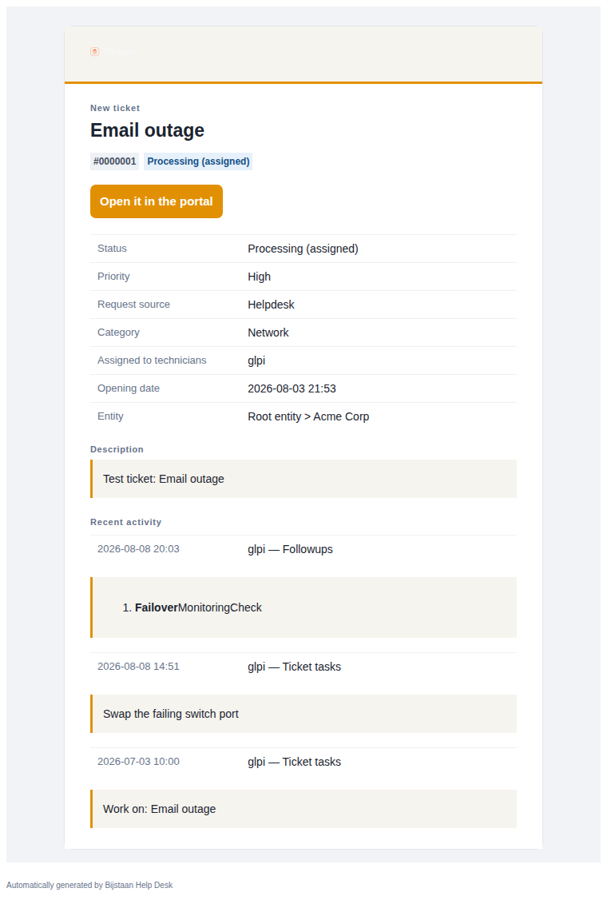
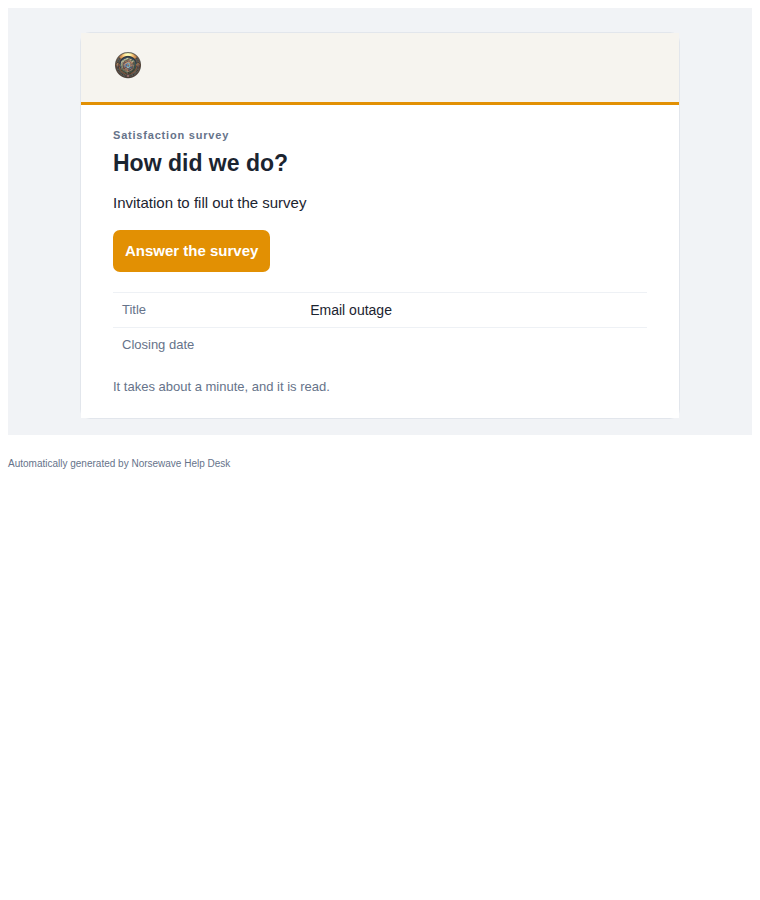
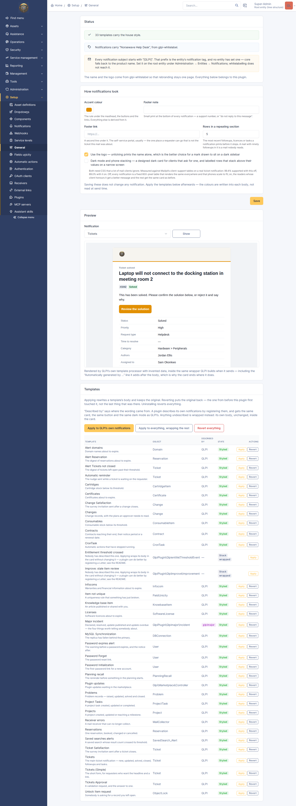
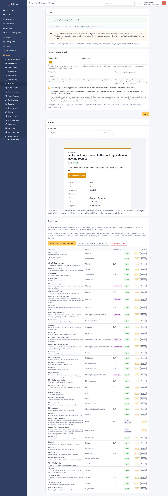
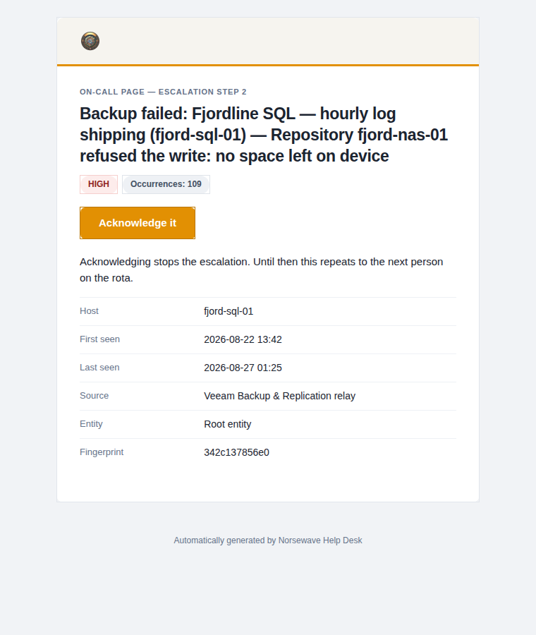

# GLPI Mail

Responsive, branded notification templates for a whole GLPI 11 instance.

Thirty-two templates covering every notification GLPI ships: tickets, changes,
problems, approvals, satisfaction surveys, reservations, stock and expiry alerts,
passwords, projects, the knowledge base, and the housekeeping ones nobody looks
at until they matter.



Output is a fixed 600-pixel table built from `cellpadding`, `bgcolor` and spacer
cells — the subset of HTML every mail client agrees on. See
[Client support](#client-support) for the measurements.



## What it replaces

GLPI 11.0.8 seeds its notification templates from `install/empty_data.php`, and
the HTML bodies in that file are stored **HTML-escaped** — `&lt;div&gt;` where
`<div>` was meant. Nothing in the send path decodes them:
`NotificationTemplate::getTemplateByLanguage()` runs the body through
`process()`, which substitutes tags and rewrites relative `href`s, then
concatenates the result straight into `<body>`.

A stock GLPI 11.0.8 therefore sends this to an entity:

```
&lt;!-- description{ color: inherit; background: #ebebeb; … } --&gt;
&lt;div&gt;&lt;/div&gt;
&lt;div&gt; URL : &lt;a href="…"&gt;&lt;/a&gt; &lt;/div&gt;
&lt;p class="description b"&gt;&lt;strong&gt;Ticket: Description&lt;/strong&gt;&lt;/p&gt;
```

Reproduce it with `tests/process.php`'s harness. Two more found while reading the
targets rather than the tag lists:

- The stock **certificate** and **domain** expiry templates use flat tags with no
  `##FOREACH##` around them, but `NotificationTargetCertificate` and
  `NotificationTargetDomain` only fill those tags inside the loop. Every field
  but the entity name arrives blank.
- The stock **reservation** template asks for `##reservation.tech##`, which is
  not a tag. It is printed literally.

## Applying it

Nothing happens on install. Templates are something administrators edit, often
once, years ago, with wording somebody approved.

**Setup → General → GLPI Mail** has three buttons:

- **Apply to GLPI's own notifications** — rewrites the thirty-two described in
  `src/Catalog.php`.
- **Apply to everything, wrapping the rest** — plus anything else in the table,
  including other plugins' templates, whose bodies go inside the same card
  unchanged.
- **Revert everything** — restores the body from before this plugin first touched
  it. So does uninstalling, which matters: a styled body references this plugin's
  own logo endpoint, and leaving it behind would put a broken image at the top of
  every mail weeks later with nothing connecting it to a removed plugin.



Original bodies live in `glpi_plugin_glpimail_backups`, written once per
translation — the second apply does not back up the first apply's output.



Settings are baked into the bodies rather than read at send time, so changing the
accent means applying again. The page says so.

## Branding

Name and logo come from `glpiwhitelabel`, on the same terms glpipdf uses:

| glpiwhitelabel | What a notification carries |
| --- | --- |
| configured | its name and logo |
| absent or unconfigured | nothing — no name, no logo, no "GLPI" |
| half-configured | whatever it has |

Two formats glpiwhitelabel is right to accept are wrong in an inbox, and the
settings page says so rather than shipping a broken image:

- **SVG** — no mainstream mail client renders it.
- **WebP** — Outlook on Windows renders it as nothing at all.

Both fall back to the wordmark, as does a blocked image: the logo is an ``
whose `alt` is the brand name, which is what most first-time readers see anyway
since Outlook and Gmail block remote images by default.

## Describing a plugin's own notifications

Without doing anything, a plugin's template is **wrapped** — its own body inside
the house card, untouched. That is the right fallback and a poor destination: a
wrapped body keeps whatever markup its author could write in GLPI's template
editor, usually a `<ul>` of bolded labels. Wrapping makes the estate's mail share
an envelope; describing makes it share a design. It is also the difference
between a notification having a button and having a link in a paragraph.

Register under `glpimail_letters`, the same shape glpipdf uses for
`glpipdf_documents`:

```php
$PLUGIN_HOOKS['glpimail_letters']['glpisignal'] = [MailLetters::class, 'offers'];
```

```php
public static function offers(): array
{
    // glpi-mail is optional. Returning an offer that references one of its
    // classes when it is not installed turns a missing optional dependency
    // into a fatal.
    if (!class_exists(Letter::class)) {
        return [];
    }

    return [[
        'name'     => 'On-call page',        // the NotificationTemplate's name
        'itemtype' => Alert::class,
        'summary'  => __('The page sent to whoever is on call.', 'glpisignal'),
        'build'    => [self::class, 'page'],
    ]];
}

public static function page(): Letter
{
    return Letter::make()
        ->eyebrow('##alert.action## — ##lang.alert.step## ##alert.step##')
        ->title('##alert.name##')
        ->pill('##alert.severity##', Letter::BAD)
        ->button('Acknowledge it', '##alert.url##')
        ->row('##lang.alert.host##', '##alert.host##', when: 'alert.host')
        ->row('##lang.alert.first_seen##', '##alert.first_seen##')
        ->when('alert.comment', static fn(Letter $l) =>
            $l->panel('##lang.alert.comment##', '##alert.comment##'));
}
```



`Letter` says *what* the mail contains — an eyebrow, a title, a status pill,
labelled rows, a quoted panel — and nothing about how it is drawn, for the same
reason glpipdf's `Doc` says nothing about TCPDF. There is no column, box, width
or colour in the vocabulary.

Everything is plain text except `##tags##`, which pass through untouched.
`##x.y##` is substituted at send time and `##lang.x.y##` with a label translated
into the recipient's language; use the `lang` form for every field label you can.

| You write | Why it matters |
| --- | --- |
| `->pill(…)` twice | one row of pills, not two stacked tables |
| `when: '##alert.host##'` | the hashes come off — GLPI's `##IF##` needs the bare field, and left on it renders `##IF##alert.host####`, which matches nothing and silently drops the block |
| `->pill('x', 'critical')` | an unknown tone is a grey pill, not a lost notification |
| `->loop('events', 5, …)` | `##FOREACH LAST 5 events##`, capped so a mail is a summary |

An offer whose name and itemtype match one of GLPI's own is refused and logged,
so a plugin cannot quietly redefine a ticket notification through a name
collision. A builder that throws is dropped and logged; every other template
still applies.

The settings page's **Described by** column says where each body's wording came
from: GLPI, a plugin, or nobody.

Five plugins in this suite describe their notifications. Two of them previously
bypassed GLPI's template system and wrote finished bodies straight into
`glpi_queuednotifications`:

- **glpisignal** composed on-call pages in PHP. Its wording now lives in a seeded
  template, so a page arrives as the house card with the severity as a pill and a
  full-width Acknowledge button.
- **glpireport** sent the whole report as the message body, because the report is
  a complete `<!DOCTYPE html>` document that a template would nest inside
  another. The mail is now a covering note with the headline figures, and the
  report travels as an attachment and at its own URL.

In both, composition moved and delivery did not: who gets paged is the on-call
rota, and who receives a review is the contacts on that report. Neither is a
`Notification` target list, so both still queue their own rows.

glpimail is optional in all five, each guards its offer on
`class_exists(Letter::class)`, and with glpimail absent every one of those
notifications still sends.

## Does GLPI know its own address?

Every link in every mail, and this plugin's masthead image, is built from
`url_base` at send time. If it is wrong, mail goes out with a broken logo and
links nobody can follow, and nothing in the interface says so.

The settings page compares `url_base` against the address you are browsing and
says something when they differ. It is a hint, not proof: a reverse proxy, or an
internal and an external name, are both good reasons to disagree.

It also flags the **subject line**, the one place "GLPI" still gets through a
fully whitelabelled instance: core prefixes every notification with the entity's
`notification_subject_tag` and falls back to the literal product name when no
entity has set one. glpiwhitelabel's `app_name` override does not reach it, and
neither can this plugin.

The preview renders exactly the way the mail does, so a wrong `url_base` shows up
there as a broken image too. Better there than in eight hundred inboxes.

## The preview

Renders any template in an iframe using GLPI's own
`NotificationTemplate::process()` on invented data, inside the wrapper GLPI
builds when it sends — including the `Automatically generated by …` line GLPI
appends *after* the body.

That line is a bare text node with no element around it, so no selector reaches
it and no inline style can be put on it. It is the reason `src/Css.php` styles
`body` at all, and a preview that hid it would hide the one piece of the layout
this plugin does not control.

## How it is built

| File | What it decides |
| --- | --- |
| `src/Catalog.php` | what each notification says, as blocks |
| `src/Shell.php` | what a block looks like, in HTML and in plain text |
| `src/Theme.php` | the palette, light and dark, derived from one accent |
| `src/Css.php` | the `<style>` block: media queries and `prefers-color-scheme` |
| `src/Brand.php` | whose name is on it |
| `src/Logo.php` | the masthead image, downscaled and cached |
| `src/Templates.php` | reading and writing GLPI's templates, and the backup |
| `src/Preview.php` | the send path, minus the recipient |

One description, two renderings: the plain-text alternative comes from the same
blocks as the HTML, so it cannot drift the way a hand-maintained pair does.

## Client support

Mailpit scores a message against caniemail's client-support tables. On a real
ticket notification every template scores between **99.15% and 99.77%
supported**, with unsupported under 0.4%. It started at 89.0%.

The scoring is per node, weighted by client share, so what a property costs is
what the clients failing it are worth times how much of the message uses it.
Measured one at a time:

| Dropped | Replaced by |
| --- | --- |
| `padding` | `cellpadding` and gutter cells |
| `margin` | spacer rows |
| `text-align` | `align=` |
| `font-weight` | `<strong>` |
| `background-color`, `width`, `height`, `border` | `bgcolor`, `width`, `height`, and a 1px coloured table for the card's edge |
| `display`, `max-width`, `max-height`, `white-space`, `word-break`, `outline`, `text-transform` | nothing — they were polish |

What survives in `style=` is `color`, `font-family` and `font-size`, which cost
nothing, plus four properties kept on a handful of nodes each:

| Kept | Where | Cost everywhere → cost here |
| --- | --- | --- |
| `text-decoration:none` | the button's anchor | 2.23 → 0.00 |
| `line-height` | the title, lede, quoted panel | 1.25 → 0.04 |
| `letter-spacing` | the small-caps labels | 0.84 → 0.00 |
| `border-radius` | the card's edge and the button | 2.62 → 0.00 |

Two warnings can never be removed, because they are GLPI's wrapper rather than
this plugin's markup: `<body>` (38.8% supported) and `<style>` (61.1%), both
emitted by `NotificationTemplate::getTemplateByLanguage()` whatever the template
says. A message containing nothing but "hello" inside that wrapper scores 89.8%.

The visible cost is small: the eyebrow and section labels are sentence case
rather than upper (`text-transform` had to go, and the text is a `##tag##` so it
cannot be upper-cased at build time), and the status pills are square.

### An unclosed `<font>`, on purpose

The body ends with an open `<font>` tag. GLPI appends its "Automatically
generated by …" line after the template body and inside `<body>`, as a bare text
node. HTML parsing closes the `<font>` at `</body>`, so that line inherits from
it and arrives as small muted type instead of the client's default 16px serif. It
costs nothing on the score, and a sanitiser that closes or drops it leaves the
line where it started. `tests/render.php` asserts it is there and that it is the
only unclosed element.

### The enhancement layer is opt-in

Dark mode and phone stacking both need `@media` and `!important`, which together
cost about ten points: 99.4% becomes 89.0%. They are a setting, off by default,
and the page states both numbers next to the checkbox. Off, every notification is
a fixed 600-pixel table that renders the same everywhere and that phones scale to
fit. On, readers whose client honours it get a better message and the rest get
the same card as before.

## Install

```bash
# from the GLPI root — the directory must be named for the plugin key,
# which is not the repository name
git clone https://github.com/bijstaan/glpi-mail.git plugins/glpimail
php bin/console plugin:install -u glpi glpimail
php bin/console plugin:activate glpimail
```

GLPI 11.0 or later. No composer dependencies. `glpiwhitelabel` is optional;
without it, notifications are styled but unbranded.

## Tests

```bash
sh tests/run.sh                                             # pure PHP, runs in CI
docker exec glpi-glpi-1 php \
    /var/www/glpi/plugins/glpimail/tests/process.php        # against a real GLPI
cd tests/browser && SHOT_DIR=../../docs/screenshots node mail-check.js
```

`render.php` renders all thirty-two and checks what a mail template is silently
wrong about: unbalanced `##IF##` and `##FOREACH##`, markup that does not close, a
tag whose case got mangled.

`process.php` puts every body through GLPI's own processor and requires nothing
beginning `##` survives. A surviving tag is one GLPI would have printed to a
entity.

`mail-check.js` drives the settings page, then renders a real ticket through
GLPI's send path before and after applying: the "before" must be escaped (the bug
at the top of this file) and the "after" a card. It fetches the logo endpoint
from a context with no session, since Gmail's image proxy has none, and finishes
by reverting and checking the original body came back byte for byte. It writes
the screenshots in this README.

It caught four things:

- **The form action.** `$_SERVER['PHP_SELF']` is `/index.php` under GLPI 11's
  front controller, so Apply posted to the router, got a 400, and left the page
  looking as though it had worked. The forms now carry no `action` at all.
- **Two headings that rendered empty or wrong.** `##lang.ticket.items##` is
  registered as a tag by `NotificationTargetTicket` and never assigned a value,
  and `##lang.ticket.timelineitems##` is "Processing ticket" — a status, not a
  heading. The check now fails if any label, eyebrow or title in a sent body
  renders blank.
- **A race in the logo cache.** It swept the directory before writing, so one
  request could delete the file another was about to read and answer 404. It now
  writes through a `rename()` and sweeps afterwards.
- **A low-contrast button.** Tabler's `primary` follows the palette, and as an
  outline on a warm palette it all but disappeared.

## Licence

GPL-3.0-or-later, the same licence as GLPI. The plugin is loaded into GLPI's
process and extends its classes, so it is a derivative work. See
[LICENSE](LICENSE).
